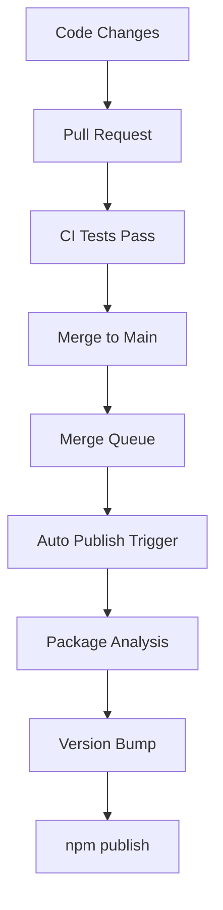

# Package Publishing

This guide covers the package publishing process for the Node.js website's multi-package workspace architecture.

## Table of Contents

- [Overview](#overview)
- [Repository Structure](#repository-structure)
- [Publishing Process](#publishing-process)

## Overview

The Node.js website uses a monorepo structure where individual packages are published to the npm registry. This approach allows for:

- Modular package distribution
- Independent versioning
- Reusable components across projects
- Better dependency management

## Repository Structure

```
nodejs.org/
├── packages/
│   ├── ui-components/          # Reusable UI components
│   ├── i18n/                   # Internationalization utilities
│   └── [other-packages]/       # Additional packages
└── apps/
    └── site/                   # Main website application
```

## Publishing Process

Publishing is handled automatically through GitHub Actions, when changes are merged to the main branch (or via `workflow_dispatch`):

1. **Merge Queue**: Changes must come through GitHub's merge queue
2. **CI Pipeline**: "Linting and Tests" workflow completes successfully
3. **Auto-trigger**: "Publish Packages" workflow runs automatically
4. **Verification**: Committer must be verified from `noreply@github.com`
5. **Notification**: Slack notification sent to `#nodejs-website` if `workflow_dispatch` was the trigger.


