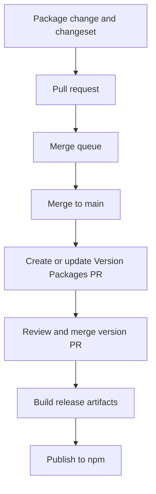

# Package Publishing

This guide covers the package publishing process for the Node.js website's multi-package workspace architecture.

## Table of Contents

- [Overview](#overview)
- [Repository Structure](#repository-structure)
- [Adding a Changeset](#adding-a-changeset)
- [Publishing Process](#publishing-process)

## Overview

The Node.js website uses a monorepo structure where individual packages are published to the npm registry. This approach allows for:

- Modular package distribution
- Independent versioning
- Reusable components across projects
- Better dependency management

## Repository Structure

```
nodejs.org/
├── packages/
│   ├── ui-components/          # Reusable UI components
│   ├── i18n/                   # Internationalization utilities
│   └── [other-packages]/       # Additional packages
└── apps/
    └── site/                   # Main website application
```

## Adding a Changeset

Package versions and release notes are managed with [Changesets](https://github.com/changesets/changesets). Changes to a published package should include a changeset in the same pull request.

Run the Changesets CLI from the repository root:

```shell
pnpm changeset
```

Select every package affected by the change, choose the appropriate semantic version bump, and write a concise summary for the changelog. Commit the generated Markdown file in `.changeset/` with the rest of the change.

The `Pull Request Policy` workflow rejects pull requests that change files under `packages/` without a changeset.

If a package change only affects internal tooling and does not require a release, run `pnpm changeset add --empty` instead.

Use `pnpm changeset:version` only to test the versioning step locally. The release workflow normally runs it and manages the resulting version changes.

## Publishing Process

Publishing is handled automatically by the `Publish Packages` GitHub Actions workflow:

1. **Merge Queue**: Changes must come through GitHub's merge queue
2. **Collect changesets**: Merged changesets are collected into a `chore: version packages` pull request
3. **Version packages**: The version pull request updates package versions and changelogs
4. **Review and merge**: The version pull request goes through the normal review and merge queue
5. **Publish**: After that pull request lands, the workflow builds the workspace packages and publishes every newly versioned package to npm using trusted publishing
6. **Notify**: A release notification listing the published packages is sent to `#nodejs-web-infra-alerts`

Package versions should not be edited or published manually. A failed publishing run can be retried from GitHub Actions after its cause is resolved.


```mermaid
graph TD
    A[Package change and changeset] --> B[Pull request]
    B --> C[Merge queue]
    C --> D[Merge to main]
    D --> E[Create or update Version Packages PR]
    E --> F[Review and merge version PR]
    F --> G[Build release artifacts]
    G --> H[Publish to npm]
```
