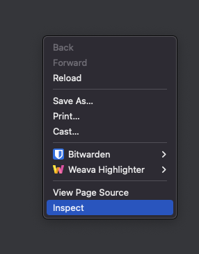
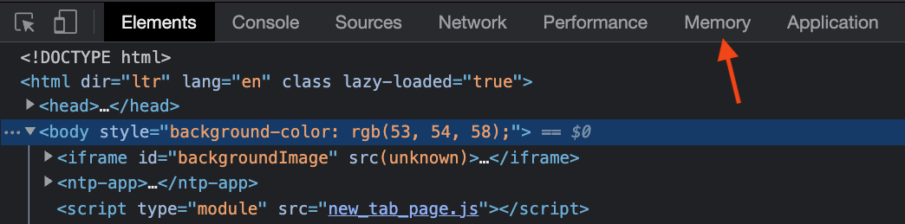
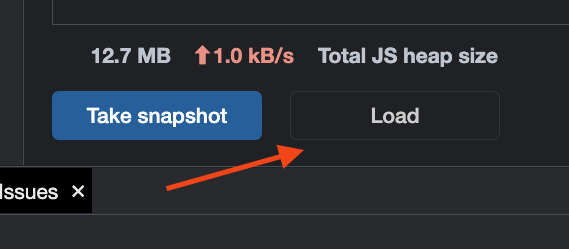
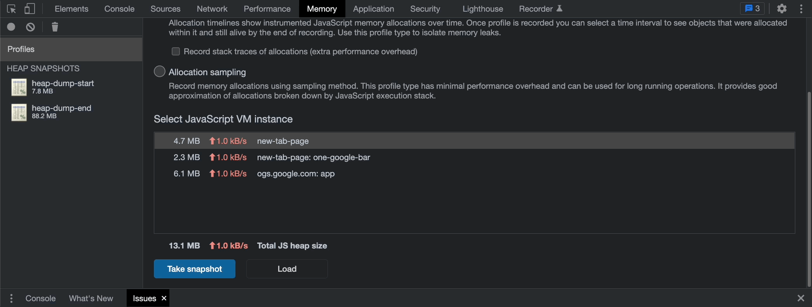

# Diagnosis Memory Leak

In this guide, you'll go through the fundamentals of memory leak diagnosis. And this, using built-in tools.

## Setup

For the proposal of this guide, we will use a simple web server empowered with [Fastify](https://www.fastify.io/).

1 - Create a new project

```bash
npm init -y
```

2 - Install dependencies

```bash
npm i fastify
```

3 - Create a simple server (server.js)

```js
import Fastify from 'fastify';

const server = Fastify();
const entries = new Set();

server.get('/write', () => {
  const date = new Date().toString();

  // don't do this at home
  entries.add({
    date,
    arch: os.arch(),
    platform: os.platform(),
    cpus: os.cpus()
  });

  return true;
});

server.get('/read', () => {
  return { count: entries.size() };
});

server.listen(9999, (err, address) => {
  if (err) {
    console.error(err);
    process.exit(1);
  }

  console.log(`server listening on ${address}`);
});
```

> Even if the leak is evident here, we'll explore two different tools that could help us to spot the leak. However, in the context of a real-world application finding the source of a leak could be cumbersome.

4 - Run the application server

```bash
node --trace-gc server.js
```

It should output something like:

``` bash
[13973:0x110008000]       44 ms: Scavenge 2.4 (3.2) -> 2.0 (4.2) MB, 0.5 / 0.0 ms  (average mu = 1.000, current mu = 1.000) allocation failure
[13973:0x110008000]       75 ms: Scavenge 2.7 (4.7) -> 2.4 (5.4) MB, 0.9 / 0.0 ms  (average mu = 1.000, current mu = 1.000) allocation failure
[13973:0x110008000]      151 ms: Scavenge 3.9 (5.7) -> 3.4 (8.5) MB, 0.6 / 0.0 ms  (average mu = 1.000, current mu = 1.000) allocation failure
[13973:0x110008000]      181 ms: Scavenge 5.3 (8.5) -> 4.3 (8.7) MB, 0.5 / 0.0 ms  (average mu = 1.000, current mu = 1.000) allocation failure
[13973:0x110008000]      245 ms: Scavenge 6.8 (9.8) -> 5.9 (10.5) MB, 0.6 / 0.0 ms  (average mu = 1.000, current mu = 1.000) allocation failure
[13973:0x110008000]      271 ms: Scavenge 7.5 (10.5) -> 6.4 (15.8) MB, 0.9 / 0.0 ms  (average mu = 1.000, current mu = 1.000) allocation failure
server listening on http://127.0.0.1:9999
```

Hard to read? Maybe we should pass in review a few concepts and explain the outputs of the `--trace-gc` flag.

## Concepts

The `--trace-gc` flag outputs all garbage collection events in the console. First, let me describe the composition of each line. We'll use the following line as a model:

```bash
[13973:0x110008000]       44 ms: Scavenge 2.4 (3.2) -> 2.0 (4.2) MB, 0.5 / 0.0 ms  (average mu = 1.000, current mu = 1.000) allocation failure
```

<table>
  <tr>
    <th>Token value</th>
    <th>Interpretation</th>
  </tr>
  <tr>
    <td>13973</td>
    <td>PID of the running process</td>
  </tr>
  <tr>
    <td>0x110008000</td>
    <td>Isolate (JS heap instance)</td>
  </tr>
  <tr>
    <td>44 ms</td>
    <td>Time since the process start in ms</td>
  </tr>
  <tr>
    <td>Scavenge</td>
    <td>Type / Phase of GC</td>
  </tr>
  <tr>
    <td>2.4</td>
    <td>Heap used before GC in MB</td>
  </tr>
  <tr>
    <td>(3.2)</td>
    <td>Total heap before GC in MB</td>
  </tr>
  <tr>
    <td>2.0</td>
    <td>Heap used after GC in MB</td>
  </tr>
  <tr>
    <td>(4.2)</td>
    <td>Total heap after GC in MB</td>
  </tr>
  <tr>
    <td>0.5 / 0.0 ms <br>  (average mu = 1.000, current mu = 1.000)</td>
    <td>Time spent in GC in ms</td>
  </tr>
  <tr>
    <td>allocation failure</td>
    <td>Reason for GC</td>
  </tr>
</table>

We'll only focus on two events here:
* Scavenge
* Mark-sweep

The heap is divided into "spaces." Amongst these, we have a space called the "new" space and another one called the "old" space.

> 👉 In reality, the heap is a bit different, but for the purpose of this article, we'll stick to a simpler version. If you want more details, I encourage you to look at this [talk of Peter Marshall](https://v8.dev/blog/trash-talk) about Orinoco.

### Scavenge

Scavenge is the name of an algorithm that will perform garbage collection into new space.
The new space is where objects are created. The new space is designed to be small and fast for garbage collection.

Let's imagine a Scavenge scenario:

* we allocated `A`, `B`, `C` & `D`.
  ```bash
  | A | B | C | D | <unallocated> |
  ```
* we want to allocate `E`
* not enough space, the memory is exhausted
* then, a (garbage) collection is triggered
* dead objects are collected
* living object will stay
* assuming `B` and `D` were dead
  ```bash
  | A | C | <unallocated> |
  ```
* now we can allocate `E`
  ```bash
  | A | C | E | <unallocated> |
  ```

Objects that are not garbage collected after two Scavenge operations will be promoted to old space.

> 👉 Full [Scavenge scenario](https://github.com/thlorenz/v8-perf/blob/master/gc.md#sample-scavenge-scenario).

### Mark-Sweep

Mark-sweep is used to collect objects from old space. The old space is where objects that survived the new space are living.

This algorithm is composed of two phases:
* **Mark**: Will mark still alive objects as black and others as white.
* **Sweep**: Scans for white objects and converts them to free spaces.

> 👉 In fact, the Mark and Sweep steps are a bit more elaborate. Please read this [document](https://github.com/thlorenz/v8-perf/blob/master/gc.md#marking-state) for more details.


## `--trace-gc` flag

Now we can come back to the output of the `--trace-gc` flag and see how we could interpret the console's output.

* First, install (`autocannon`)[https://www.npmjs.com/package/autocannon]:
```bash
npm i -g autocannon
```

* Then, restart the server:
```bash
node --trace-gc server.js
```

* Open a new terminal and run the following command:
```bash
autocannon http://localhost:9999/write
```

Now, if you come back quickly to the previous terminal window: you'll see that there are a lot of `Mark-sweep` events in the console. We also see that the amount of memory collected after the event is insignificant.

Now that we are experts in garbage collection! What could we deduce?

We probably have a memory leak! But how could we point to the correct object in the code? (Reminder: it's pretty apparent in this example, but what about a real-world application?)

## heap-dump

An excellent way to inspect memory is to make heap dumps and compare them. So let's tweak our code a bit by adding the following lines:

```js
/// at the bottom of the file, add:
import v8 from 'v8';

// then add:
server.get('/heap-dump/:id', (req) => {
  const id = req.params.id;
  return v8.writeHeapSnapshot(`heap-dump-${id}.heapsnapshot`);
});
```

We exposed an endpoint that will perform a heap dump for us. We'll use it to generate a dump at different states of our application. Let's try it.

1. It's time to rerun our server (without any flag this time):

```bash
node server.js
```

2. Open a new terminal, and generate a first dump:

```bash
curl http://localhost:9999/heap-dump/start
```

You should see a `heap-dump-first.heapsnapshot` file in your current directory.

3. Now run the test command:

```bash
autocannon http://localhost:9999/write
```

4. Once it is finished, generate a second dump:

```bash
curl http://localhost:9999/heap-dump/end
```

You should see a `heap-dump-end.heapsnapshot` file in your current directory.

5. Let's compare them on chrome:

* Open your chrome browser (or any chrome based browser).

* Open [Chrome DevTools](https://developer.chrome.com/docs/devtools/open/)

<div align="center">
  
</div>

* Click on the "Memory" tabs

<div align="center">
  
</div>

* Load your both snapshots with the "Load" button (one by one)

<div align="center">
  
</div>

* Click on the "end" snapshot and compare them:
    * Click on "Objects allocated between heap-dump-start and heap-dump-end - It will help us see what's happened between our states (start and end).
    * Sort object by "Retained size" (size freed if the object and dependents ones are deleted)
    * Then you can expand the first line recursively until you find the most significant object
    * Once you find it, click on it, and you'll be able to find the name in the description below

<div align="center">
  
</div>

As expected, we saw the `entries` object (the Set we created in `server.js`) as the "most significant object.

## Going further?

What do you think about fixing this leak, making a new snapshot, and observing the difference? Then, do it on your own!

* comment the `/read` endpoint
* restart the server
* generate your snapshots
* compare them in the Chrome dev tool

Hope you appreciate playing with diagnostic tools. In case, did you know that Node.Js documentation contains a list of tools for diagnostics purposes? Feel free to [check it](https://github.com/nodejs/node/blob/master/doc/contributing/diagnostic-tooling-support-tiers.md) out.

## References:
* https://v8.dev/blog/trash-talk
* https://github.com/thlorenz/v8-perf/blob/master/gc.md
* https://developer.chrome.com/docs/devtools/memory-problems/memory-101/
